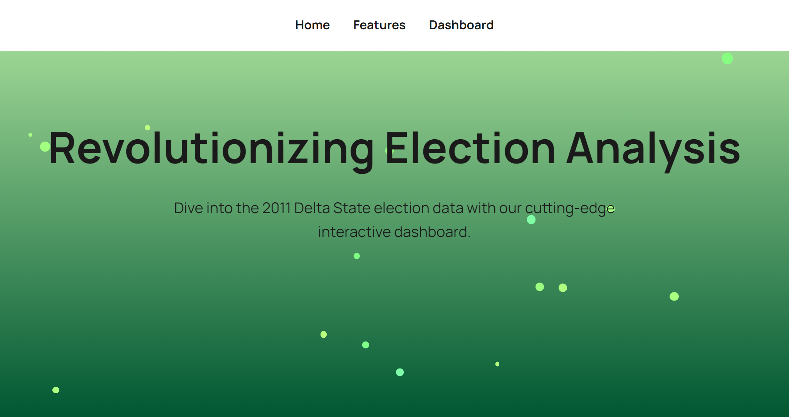
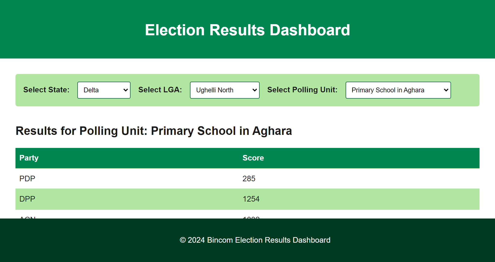
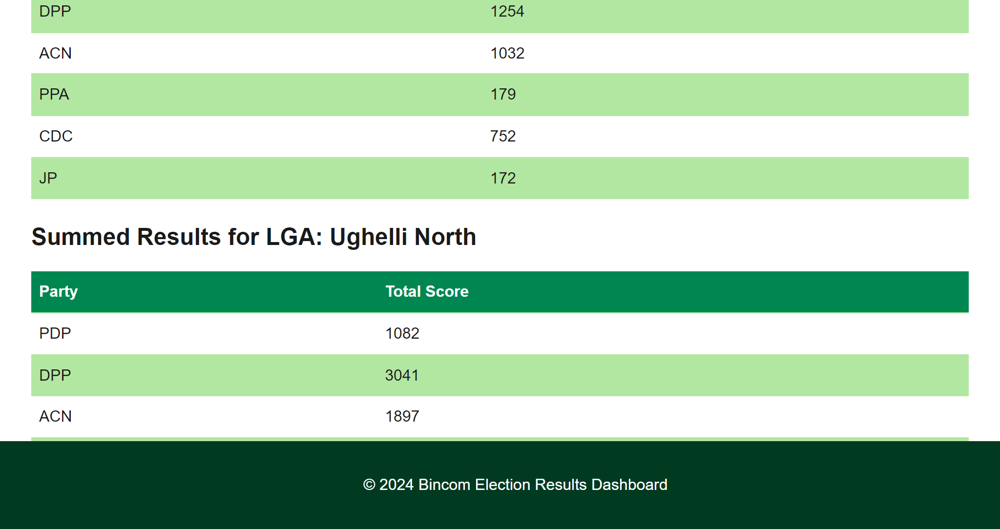

# Bincom Election Results Dashboard

Welcome to the **Bincom Election Results Dashboard**, a simple platform that revolutionizes election analysis. 

## 📊 Key Features

### 🗳 Polling Unit Insights
Analyze results from individual polling units across Nigerian States. Understand the voter turnout and performance at a granular level.

### 🌍 LGA Summaries
Get detailed summaries for Local Government Areas (LGAs) at a glance. View total votes, party performance, and other critical data.

### 🔍 Result Comparisons
Cross-check polling unit totals with announced LGA results to ensure transparency. See where discrepancies may occur.

## 🚀 Ready to Dive In?
Click the link below to launch the dashboard and start exploring the 2011 Delta State election data.

[**Launch Dashboard**](http://bincom-test.atspace.cc)

---

## 📷 Screenshots

### Home Page

### Features Overview

### Dashboard Visualizations

---
